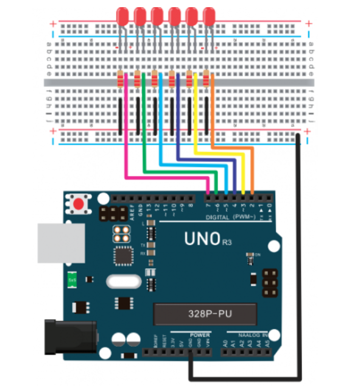

# Experiment No 3

# LED Chasing Effect

<h3>Code</h3>

```arduino
int BASE = 2 ;  // the I/O pin for the first LED
int NUM = 6;   // number of LEDs
void setup()
{
   for (int i = BASE; i < BASE + NUM; i ++) 
   {
     pinMode(i, OUTPUT);   // set I/O pins as output
   }
}
void loop()
{
   for (int i = BASE; i < BASE + NUM; i ++) 
   {
     digitalWrite(i, LOW);    // set I/O pins as “low”, turn off LEDs one by one.
     delay(200);        // delay
   }
   for (int i = BASE; i < BASE + NUM; i ++) 
   {
     digitalWrite(i, HIGH);    // set I/O pins as “high”, turn on LEDs one by one
     delay(200);        // delay
   }  
}
```

<h3>Circuit Diagram</h3>



