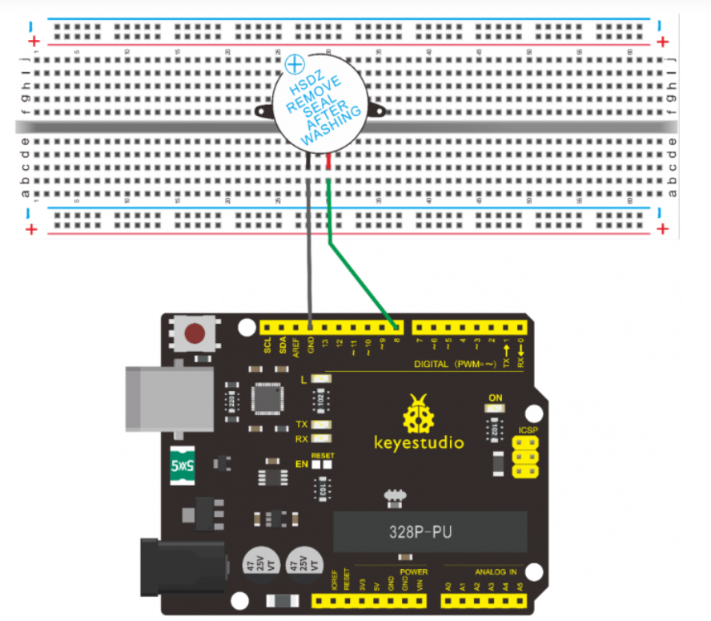

# Experiment No 5

# Buzzer

<h3>Code</h3>

```arduino
int buzzer=8;// initialize digital IO pin that controls the buzzer
void setup() 
{ 
  pinMode(buzzer,OUTPUT);// set pin mode as “output”
} 
void loop() 
{
digitalWrite(buzzer, HIGH); // produce sound
}
```

<h3>Circuit Diagram</h3>



