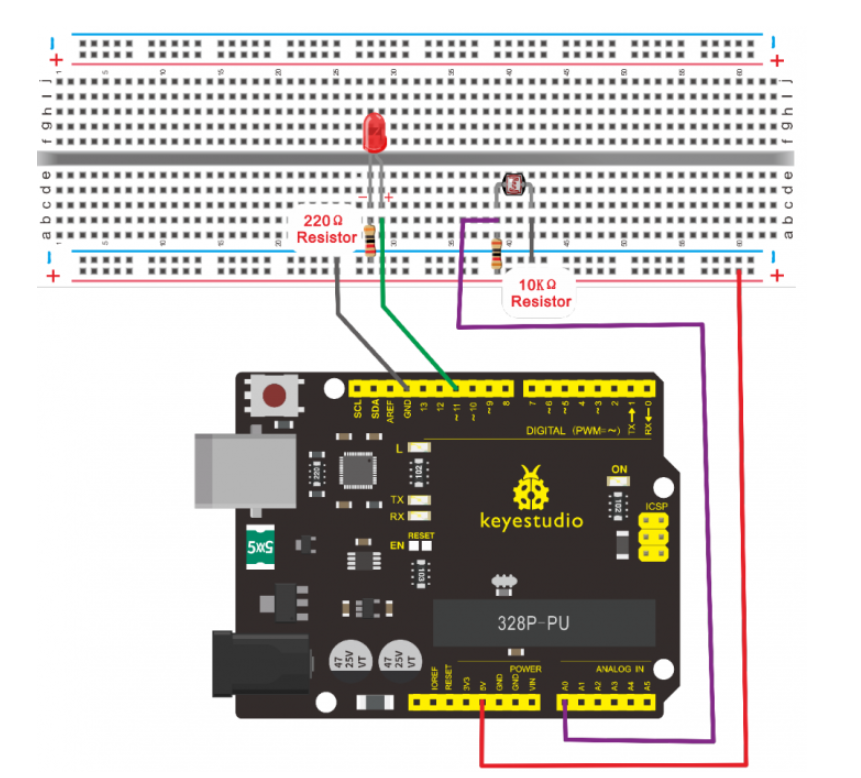

# Experiment No 7

# LDR Light Sensor

<h3>Code</h3>

```arduino
int potpin=0;// initialize analog pin 0, connected with photovaristor
int ledpin=11;// initialize digital pin 11, 
int val=0;// initialize variable val
void setup()
{
pinMode(ledpin,OUTPUT);// set digital pin 11 as “output”
Serial.begin(9600);// set baud rate at “9600”
}
void loop()
{
val=analogRead(potpin);// read the value of the sensor and assign it to val
Serial.println(val);// display the value of val
analogWrite(ledpin,val/4);// set up brightness（maximum value 255）
delay(10);// wait for 0.01 
}
```

<h3>Circuit Diagram</h3>



