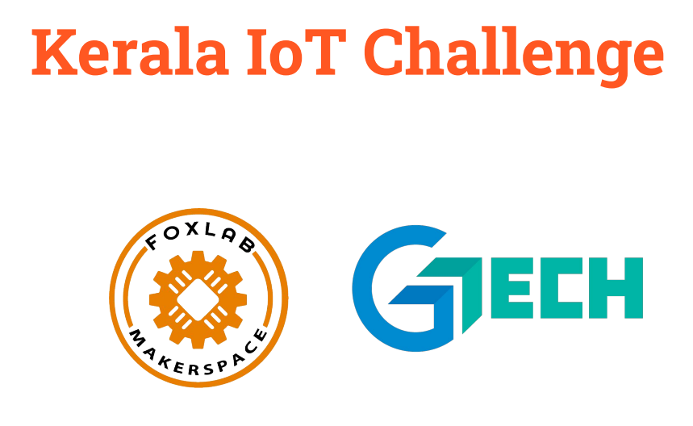

# Kerala Iot Challenge

I am [**Aldrin Andrew**](https://aldrinandrew.me/), final year Electronics an Communication Engineering student at the [**College of Engineering Perumon**](https://www.perumonec.ac.in/) 

This page is created to track my journey in Kerala Iot Challenge jointly organzed by GTECH MueLearn and FoxLabs.It was a great experience to start with the basics of microcontroller Ardunio as a Level 1.

